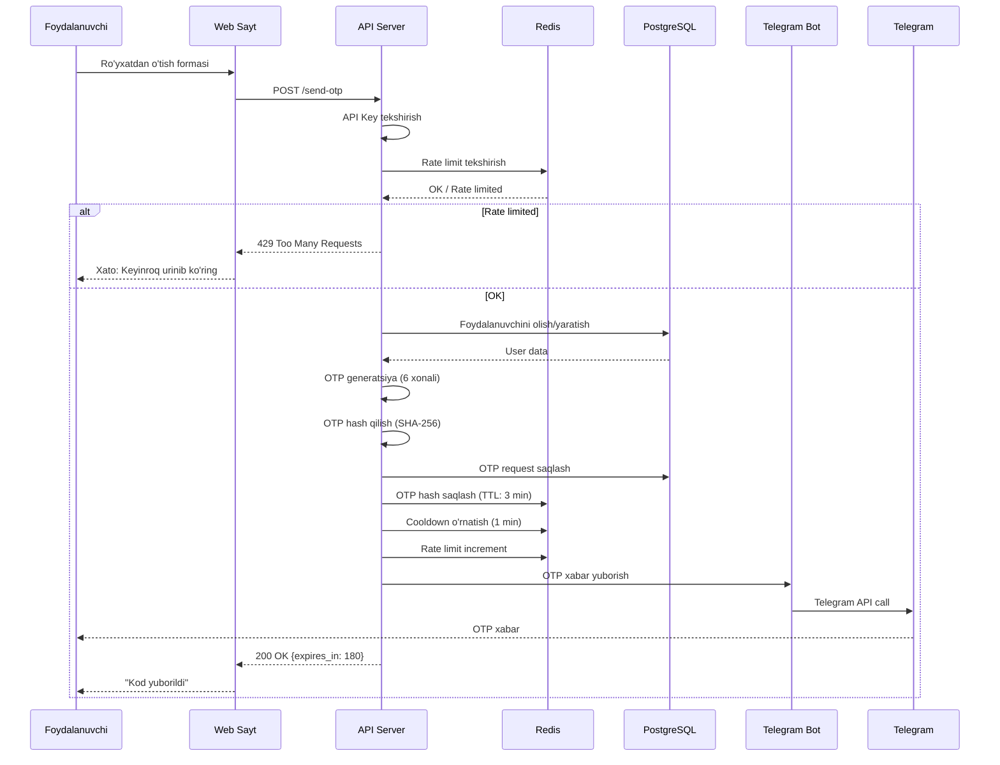
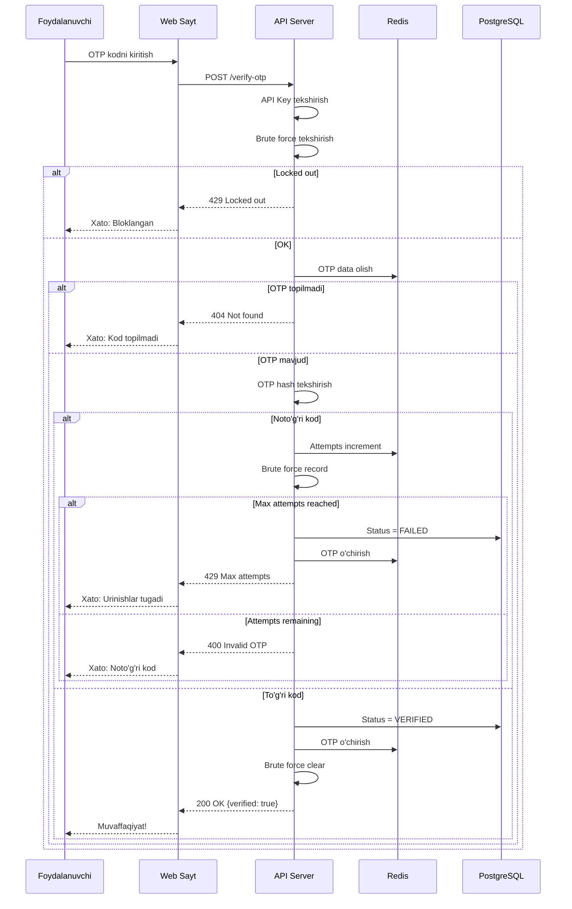
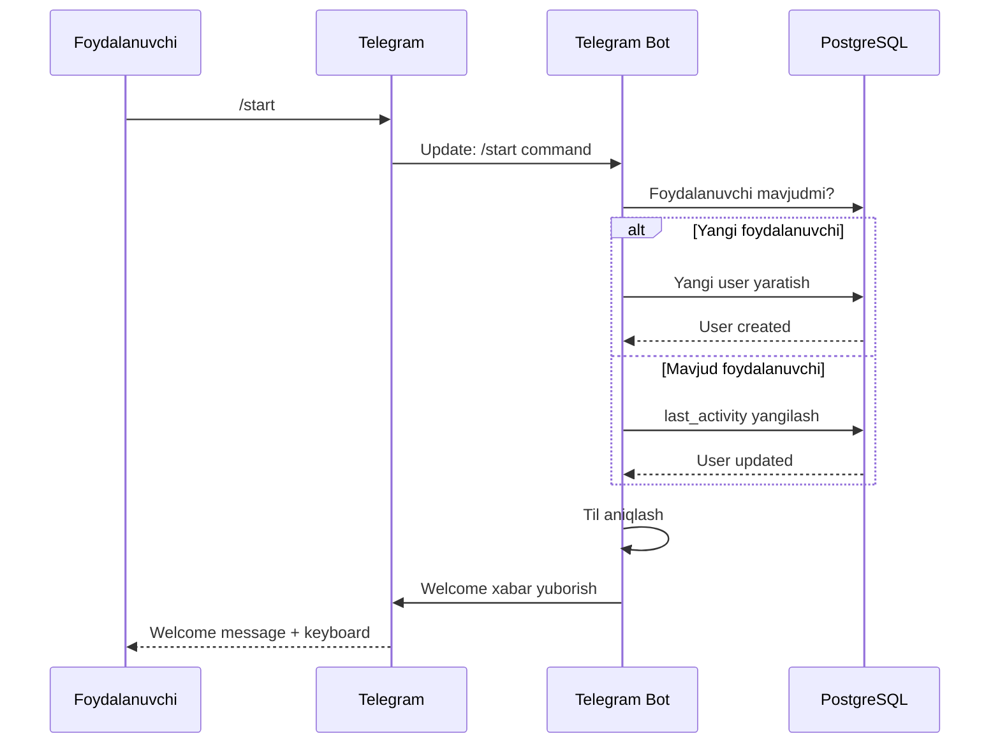
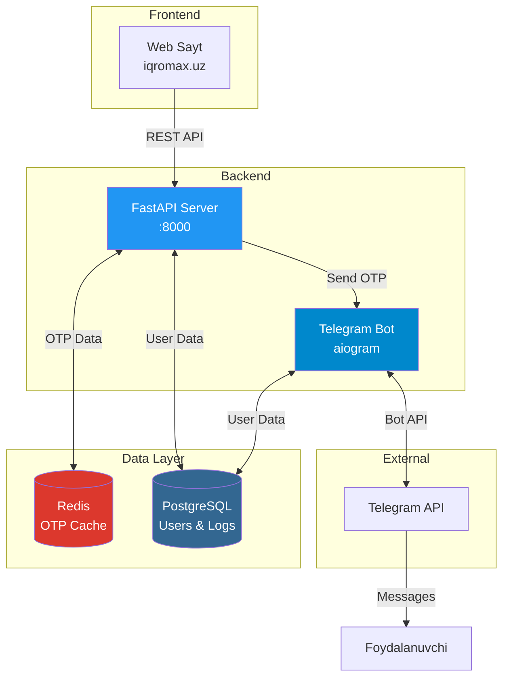
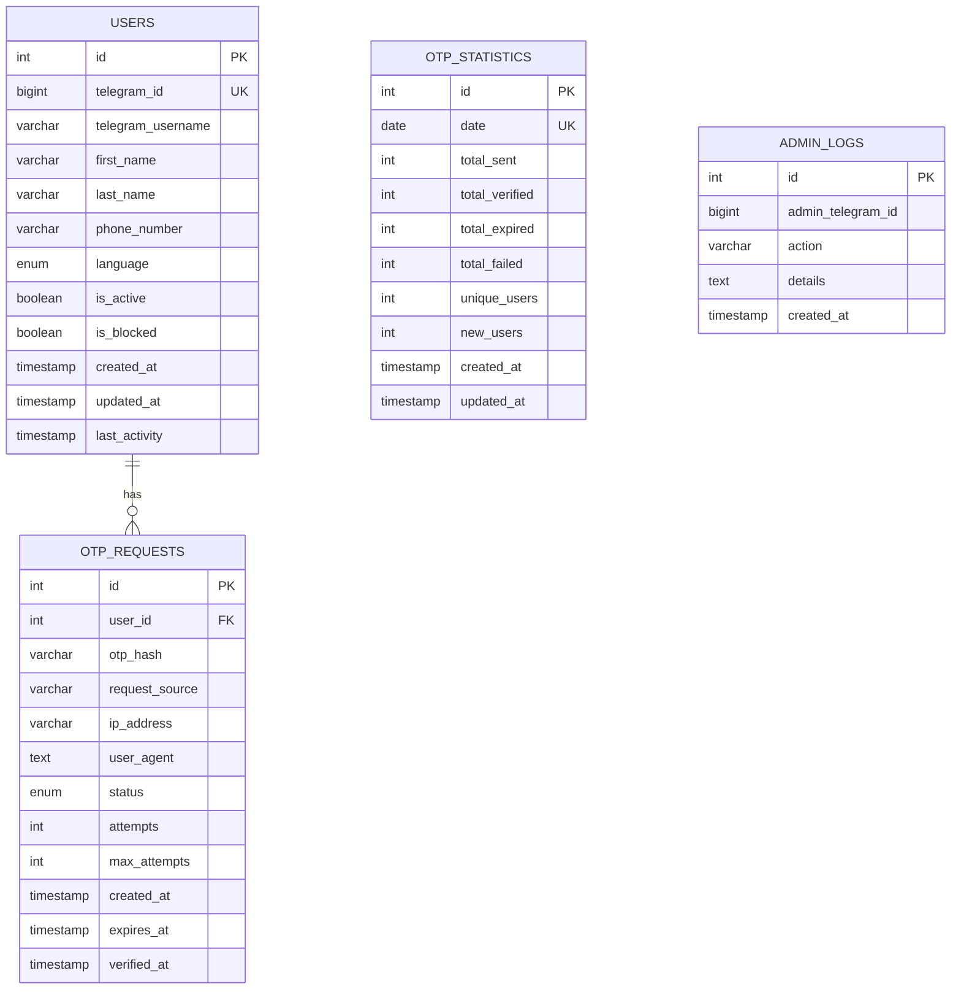
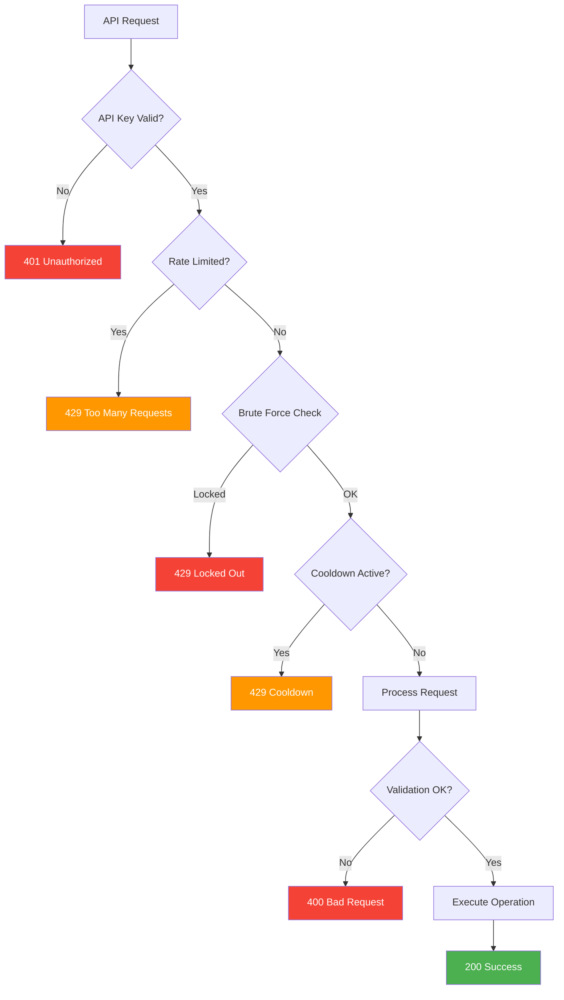

# iqromax.uz OTP Bot - Flow Diagrams

## 1. OTP Yuborish Flow

```mermaid
sequenceDiagram
    participant U as Foydalanuvchi
    participant W as Web Sayt
    participant A as API Server
    participant R as Redis
    participant D as PostgreSQL
    participant B as Telegram Bot
    participant T as Telegram

    U->>W: Ro'yxatdan o'tish formasi
    W->>A: POST /send-otp
    A->>A: API Key tekshirish
    A->>R: Rate limit tekshirish
    R-->>A: OK / Rate limited
    
    alt Rate limited
        A-->>W: 429 Too Many Requests
        W-->>U: Xato: Keyinroq urinib ko'ring
    else OK
        A->>D: Foydalanuvchini olish/yaratish
        D-->>A: User data
        A->>A: OTP generatsiya (6 xonali)
        A->>A: OTP hash qilish (SHA-256)
        A->>D: OTP request saqlash
        A->>R: OTP hash saqlash (TTL: 3 min)
        A->>R: Cooldown o'rnatish (1 min)
        A->>R: Rate limit increment
        A->>B: OTP xabar yuborish
        B->>T: Telegram API call
        T-->>U: OTP xabar
        A-->>W: 200 OK {expires_in: 180}
        W-->>U: "Kod yuborildi"
    end
```

## 2. OTP Tasdiqlash Flow

```mermaid
sequenceDiagram
    participant U as Foydalanuvchi
    participant W as Web Sayt
    participant A as API Server
    participant R as Redis
    participant D as PostgreSQL

    U->>W: OTP kodni kiritish
    W->>A: POST /verify-otp
    A->>A: API Key tekshirish
    A->>A: Brute force tekshirish
    
    alt Locked out
        A-->>W: 429 Locked out
        W-->>U: Xato: Bloklangan
    else OK
        A->>R: OTP data olish
        
        alt OTP topilmadi
            A-->>W: 404 Not found
            W-->>U: Xato: Kod topilmadi
        else OTP mavjud
            A->>A: OTP hash tekshirish
            
            alt Noto'g'ri kod
                A->>R: Attempts increment
                A->>A: Brute force record
                
                alt Max attempts reached
                    A->>D: Status = FAILED
                    A->>R: OTP o'chirish
                    A-->>W: 429 Max attempts
                    W-->>U: Xato: Urinishlar tugadi
                else Attempts remaining
                    A-->>W: 400 Invalid OTP
                    W-->>U: Xato: Noto'g'ri kod
                end
            else To'g'ri kod
                A->>D: Status = VERIFIED
                A->>R: OTP o'chirish
                A->>A: Brute force clear
                A-->>W: 200 OK {verified: true}
                W-->>U: Muvaffaqiyat!
            end
        end
    end
```

## 3. Bot Start Flow

```mermaid
sequenceDiagram
    participant U as Foydalanuvchi
    participant T as Telegram
    participant B as Telegram Bot
    participant D as PostgreSQL

    U->>T: /start
    T->>B: Update: /start command
    B->>D: Foydalanuvchi mavjudmi?
    
    alt Yangi foydalanuvchi
        B->>D: Yangi user yaratish
        D-->>B: User created
    else Mavjud foydalanuvchi
        B->>D: last_activity yangilash
        D-->>B: User updated
    end
    
    B->>B: Til aniqlash
    B->>T: Welcome xabar yuborish
    T-->>U: Welcome message + keyboard
```

## 4. Tizim Arxitekturasi

```mermaid
graph TB
    subgraph "Frontend"
        W[Web Sayt<br/>iqromax.uz]
    end
    
    subgraph "Backend"
        A[FastAPI Server<br/>:8000]
        B[Telegram Bot<br/>aiogram]
    end
    
    subgraph "Data Layer"
        R[(Redis<br/>OTP Cache)]
        D[(PostgreSQL<br/>Users & Logs)]
    end
    
    subgraph "External"
        T[Telegram API]
    end
    
    W -->|REST API| A
    A <-->|OTP Data| R
    A <-->|User Data| D
    A -->|Send OTP| B
    B <-->|User Data| D
    B <-->|Bot API| T
    T -->|Messages| U[Foydalanuvchi]
    
    style A fill:#2196F3,color:#fff
    style B fill:#0088cc,color:#fff
    style R fill:#DC382D,color:#fff
    style D fill:#336791,color:#fff
```

## 5. Database ER Diagram

```mermaid
erDiagram
    USERS ||--o{ OTP_REQUESTS : "has"
    USERS {
        int id PK
        bigint telegram_id UK
        varchar telegram_username
        varchar first_name
        varchar last_name
        varchar phone_number
        enum language
        boolean is_active
        boolean is_blocked
        timestamp created_at
        timestamp updated_at
        timestamp last_activity
    }
    
    OTP_REQUESTS {
        int id PK
        int user_id FK
        varchar otp_hash
        varchar request_source
        varchar ip_address
        text user_agent
        enum status
        int attempts
        int max_attempts
        timestamp created_at
        timestamp expires_at
        timestamp verified_at
    }
    
    OTP_STATISTICS {
        int id PK
        date date UK
        int total_sent
        int total_verified
        int total_expired
        int total_failed
        int unique_users
        int new_users
        timestamp created_at
        timestamp updated_at
    }
    
    ADMIN_LOGS {
        int id PK
        bigint admin_telegram_id
        varchar action
        text details
        timestamp created_at
    }
```

## 6. Security Flow

```mermaid
flowchart TD
    A[API Request] --> B{API Key Valid?}
    B -->|No| C[401 Unauthorized]
    B -->|Yes| D{Rate Limited?}
    D -->|Yes| E[429 Too Many Requests]
    D -->|No| F{Brute Force Check}
    F -->|Locked| G[429 Locked Out]
    F -->|OK| H{Cooldown Active?}
    H -->|Yes| I[429 Cooldown]
    H -->|No| J[Process Request]
    J --> K{Validation OK?}
    K -->|No| L[400 Bad Request]
    K -->|Yes| M[Execute Operation]
    M --> N[200 Success]
    
    style C fill:#f44336,color:#fff
    style E fill:#ff9800,color:#fff
    style G fill:#f44336,color:#fff
    style I fill:#ff9800,color:#fff
    style L fill:#f44336,color:#fff
    style N fill:#4caf50,color:#fff
```
